# Diagramas Mermaid

> Diagramas lógicos, de flujo y arquitectura del stack Matrix Docker.

---

## 1. Arquitectura general

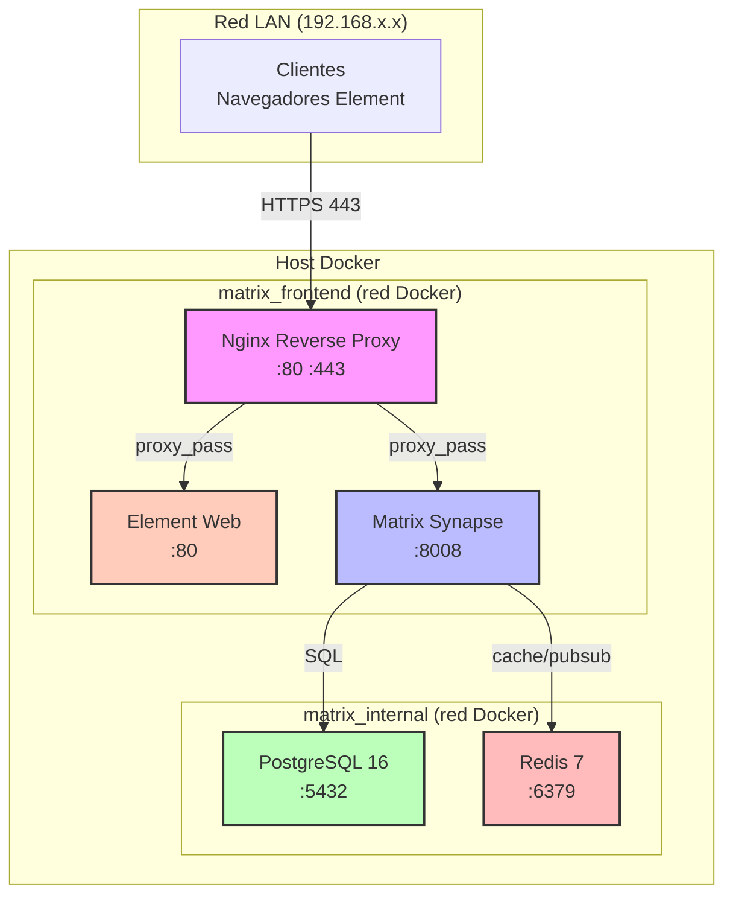

---

## 2. Topología de redes Docker

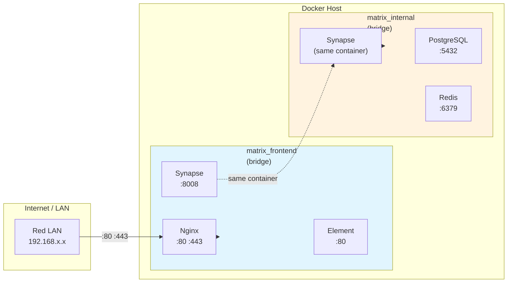

---

## 3. Flujo de una request HTTP

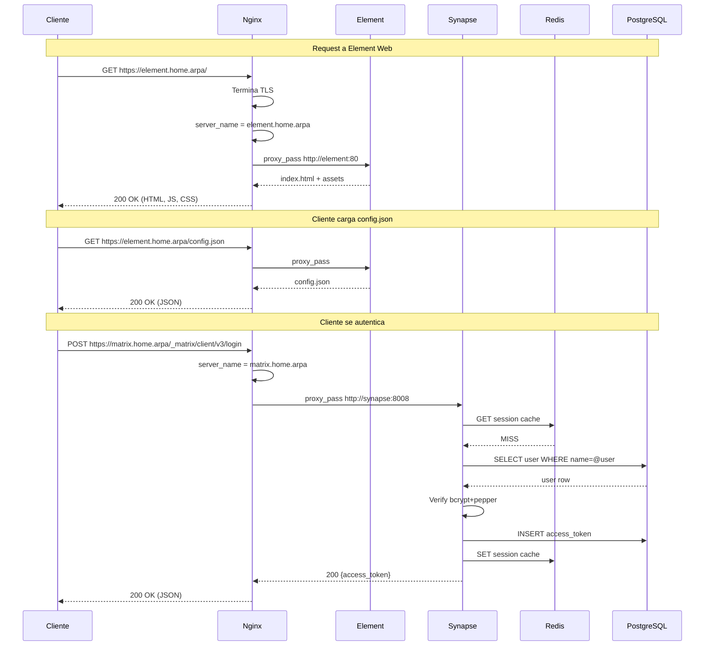

---

## 4. Flujo de mensaje enviado

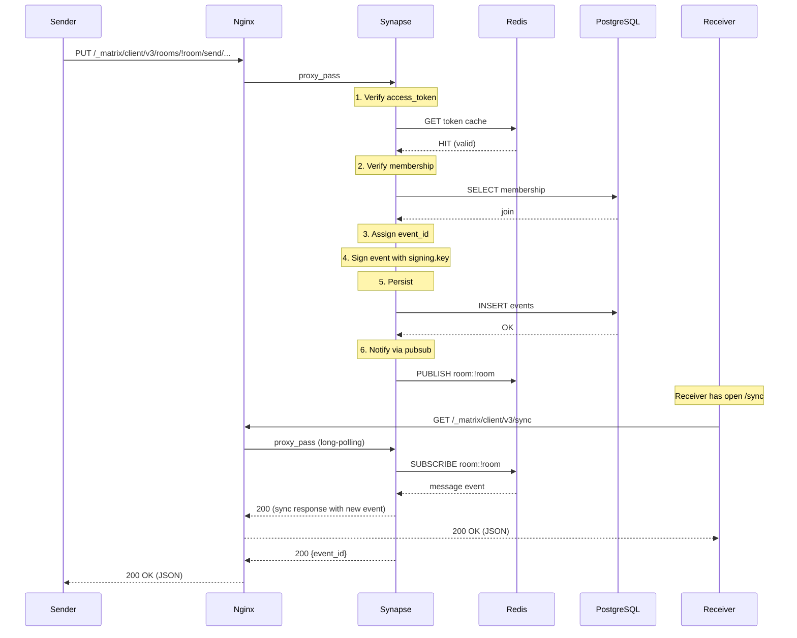

---

## 5. Diagrama de dependencias de servicios

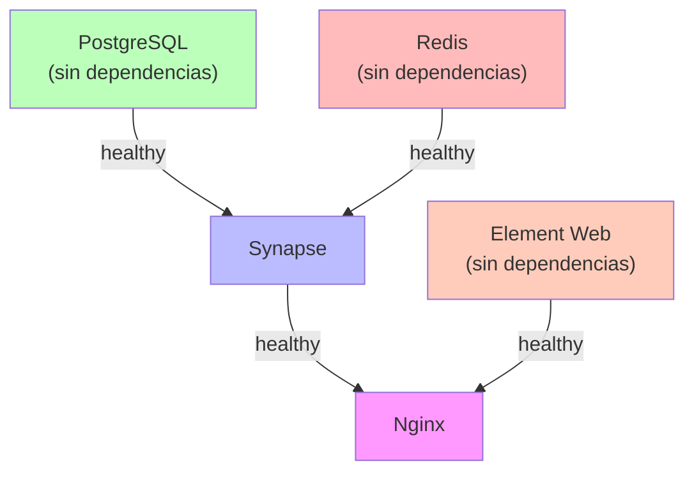

**Orden de arranque**: PostgreSQL → Redis → Synapse → Element → Nginx

---

## 6. Flujo de backup

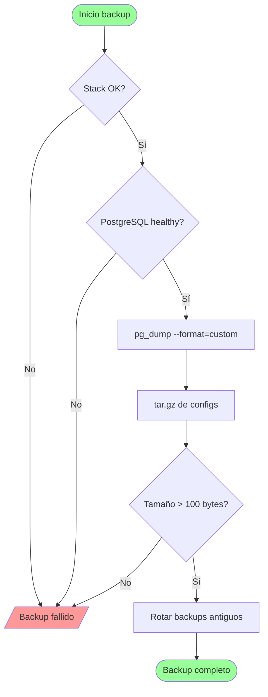

---

## 7. Flujo de restauración

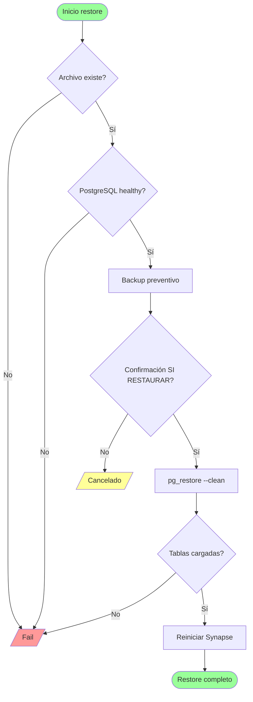

---

## 8. Flujo de migración Windows → Ubuntu

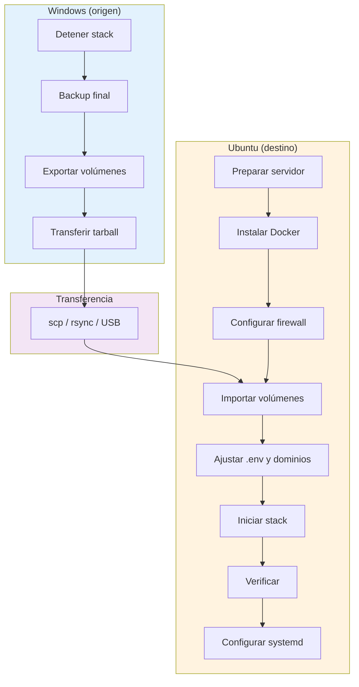

---

## 9. Modelo de datos principal

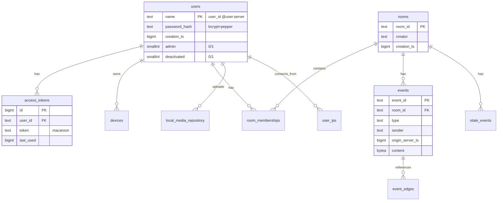

---

## 10. Diagrama de estados de servicios

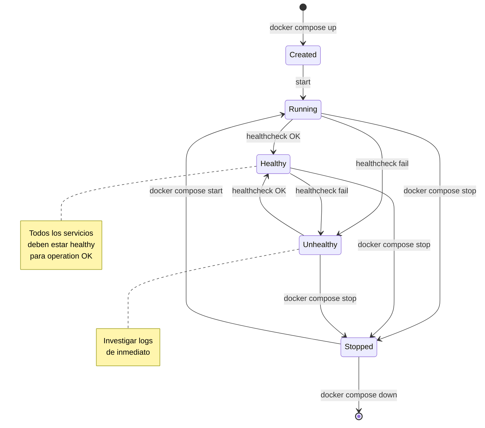

---

## 11. Flujo de actualización

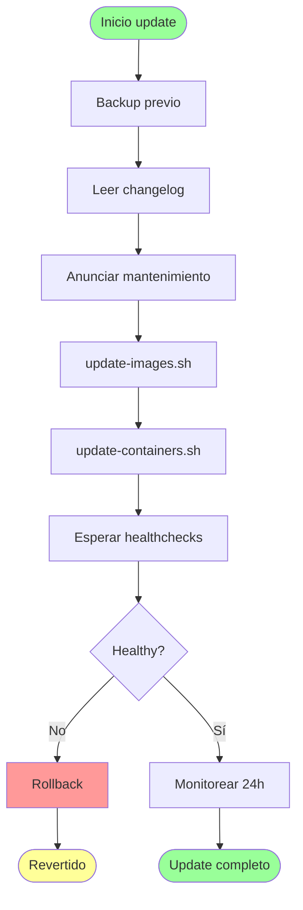

---

## 12. Matriz de puertos y accesos

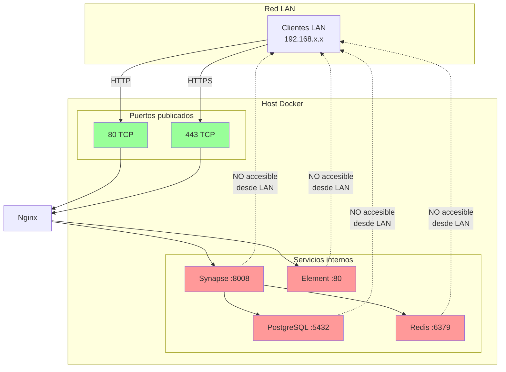

---

## 13. Estrategia de backup

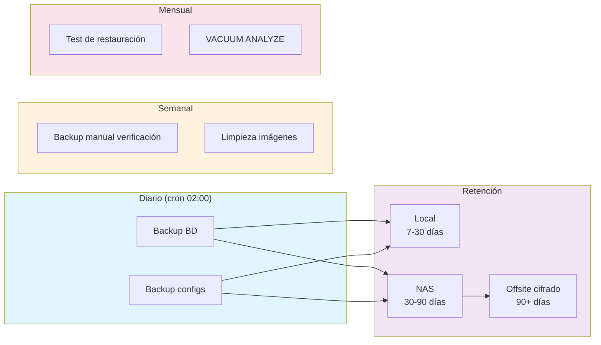

---

## 14. Procedimiento de emergencia

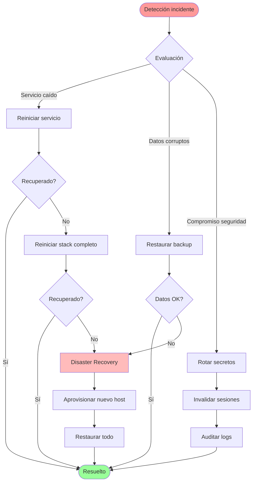

---

## 15. Ciclo de vida de un mensaje

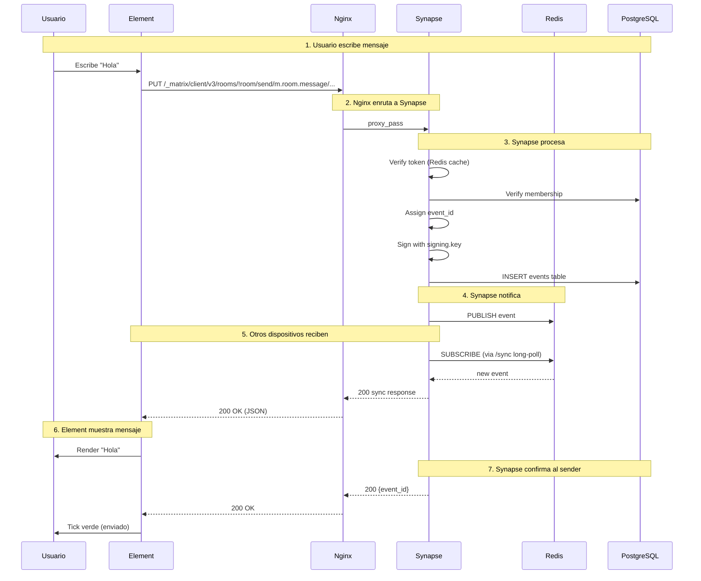

---

## 16. Diagrama de seguridad multicapa

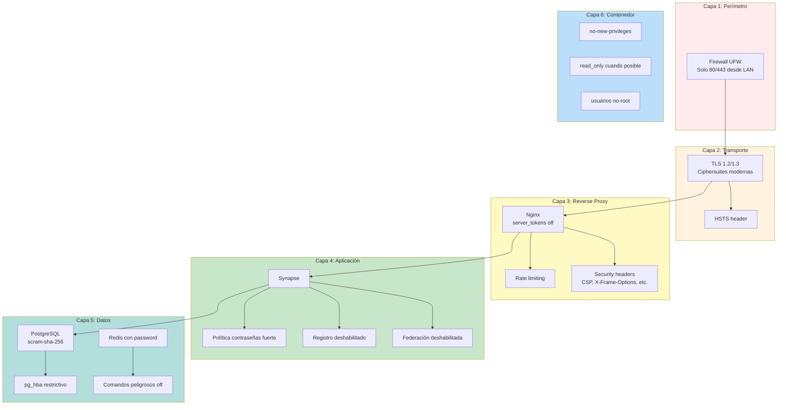

---

## 17. Flujo de certificados SSL

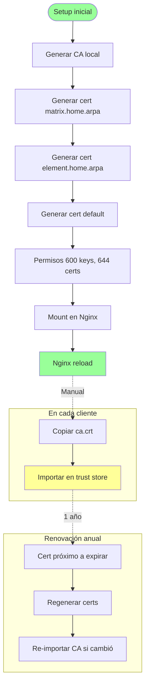

---

## 18. Diagrama de volúmenes Docker

```mermaid
graph TB
    subgraph Volumes["Volúmenes con nombre"]
        V1["matrix_synapse_data<br/>/data"]
        V2["matrix_postgres_data<br/>/var/lib/postgresql/data"]
        V3["matrix_redis_data<br/>/data"]
        V4["matrix_element_cache<br/>/var/cache/nginx"]
        V5["matrix_nginx_logs<br/>/var/log/nginx"]
    end

    subgraph BindMounts["Bind mounts (configs)"]
        B1["synapse/homeserver.yaml"]
        B2["synapse/log.config"]
        B3["synapse/signing.key"]
        B4["postgres/postgresql.conf"]
        B5["postgres/pg_hba.conf"]
        B6["postgres/init.sql"]
        B7["redis/redis.conf"]
        B8["nginx/nginx.conf"]
        B9["nginx/conf.d/"]
        B10["nginx/certs/"]
        B11["nginx/snippets/"]
        B12["element/config.json"]
    end

    V1 -->|usa| Synapse["Synapse container"]
    V2 -->|usa| Postgres["PostgreSQL container"]
    V3 -->|usa| Redis["Redis container"]
    V4 -->|usa| Element["Element container"]
    V5 -->|usa| Nginx["Nginx container"]

    B1 -.->|mount ro| Synapse
    B2 -.->|mount ro| Synapse
    B3 -.->|mount ro| Synapse
    B4 -.->|mount ro| Postgres
    B5 -.->|mount ro| Postgres
    B6 -.->|mount ro| Postgres
    B7 -.->|mount ro| Redis
    B8 -.->|mount ro| Nginx
    B9 -.->|mount ro| Nginx
    B10 -.->|mount ro| Nginx
    B11 -.->|mount ro| Nginx
    B12 -.->|build| Element

    style Volumes fill:#e1f5fe
    style BindMounts fill:#fff3e0
```

---

## 19. Escalabilidad futura

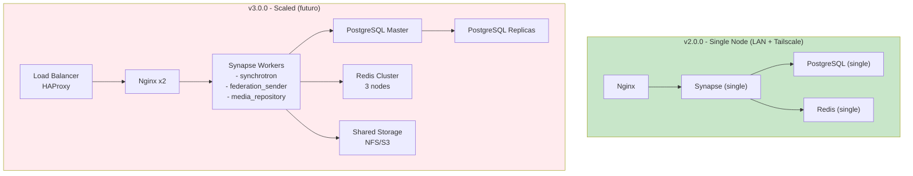

---

## 20. Matriz de responsabilidades del administrador

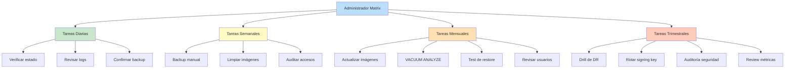
